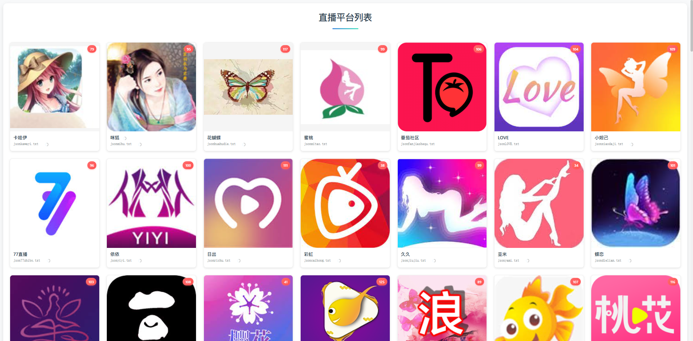
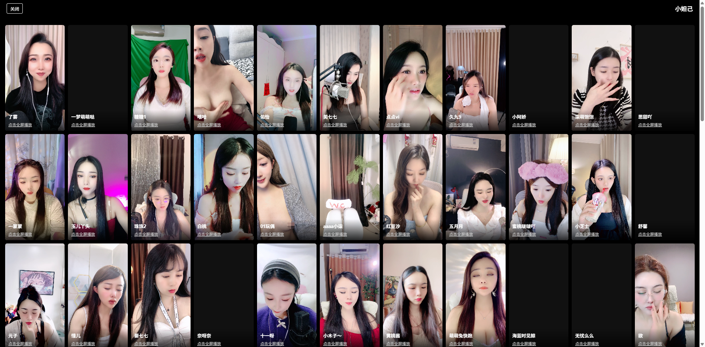

# 直播聚合平台 - 使用文档

## 📋 项目简介

这是一个直播聚合平台，可以浏览和观看多个直播平台的主播直播。支持三种观看模式：
- **普通播放模式**：单个视频播放
- **抖音观看模式**：类似抖音的竖屏观看体验
- **预览全部模式**：网格形式同时预览多个直播

### 项目截图





---

## 🔧 环境要求

### 必须安装的软件

1. **Node.js** (版本 14.0 或更高)
   - 下载地址：https://nodejs.org/
   - 推荐安装 LTS（长期支持）版本
   - 安装时选择"Add to PATH"选项

### 如何检查是否已安装 Node.js

打开命令提示符（CMD）或 PowerShell，输入以下命令：

```bash
node --version
```

如果显示版本号（如 `v18.17.0`），说明已安装；如果显示"不是内部或外部命令"，则需要安装 Node.js。

---

## 🚀 快速开始

### 方法一：使用启动脚本（推荐）

1. **双击运行 `start.bat`**
   - Windows 系统直接双击 `start.bat` 文件
   - 脚本会自动检查 Node.js 是否安装
   - 首次运行会自动安装依赖包
   - 然后自动启动服务器

2. **等待服务器启动**
   - 看到 "Server running at http://localhost:80" 表示启动成功

3. **打开浏览器访问**
   - 在浏览器地址栏输入：`http://localhost`
   - 或者：`http://127.0.0.1`

### 方法二：手动启动

1. **打开命令提示符（CMD）或 PowerShell**
   - 按 `Win + R`，输入 `cmd` 或 `powershell`，按回车

2. **进入项目目录**
   ```bash
   cd D:\VsProjects\zhibo
   ```
   （请根据你的实际项目路径修改）

3. **安装依赖（仅首次运行需要）**
   ```bash
   npm install
   ```

4. **启动服务器**
   ```bash
   npm start
   ```
   或者：
   ```bash
   node server.js
   ```

5. **打开浏览器访问**
   - 在浏览器地址栏输入：`http://localhost`
   - 或者：`http://127.0.0.1`

---

## 📖 使用说明

### 1. 浏览直播平台

- 打开主页后，会显示所有可用的直播平台
- 每个平台卡片显示：
  - 平台图标
  - 平台名称
  - 在线主播数量（红色徽章）

### 2. 查看平台主播

- **点击平台卡片**，进入该平台的主播列表
- 主播列表以网格形式展示
- 每个主播卡片显示：
  - 主播封面图
  - 主播名称

### 3. 观看直播

点击主播卡片后，会打开视频播放页面。你也可以使用以下观看模式：

#### 方式一：普通播放模式
- 直接点击主播卡片
- 打开单个视频播放页面
- 支持全屏播放

#### 方式二：抖音观看模式
- 在主播列表页面，点击顶部 **"抖音观看模式"** 按钮
- 打开类似抖音的竖屏观看界面
- 使用 **↑↓ 方向键** 或右侧按钮切换视频
- 支持全屏播放

#### 方式三：预览全部模式
- 在主播列表页面，点击顶部 **"预览全部模式"** 按钮
- 打开网格预览页面，同时显示多个直播
- 只有可视区域内的视频会自动播放
- 点击视频可以单独播放/暂停
- 点击"点击全屏播放"链接可以打开单个视频页面

---

## ⚙️ 常见问题

### Q1: 启动脚本提示"未检测到 Node.js"

**解决方法：**
1. 访问 https://nodejs.org/ 下载并安装 Node.js
2. 安装时确保勾选"Add to PATH"选项
3. 安装完成后，**重启命令提示符或电脑**
4. 再次运行 `start.bat`

### Q2: 端口 80 被占用

**解决方法：**
1. 修改 `server.js` 文件中的端口号（第114行）
   ```javascript
   const PORT = 3000; // 改为其他端口，如 3000
   ```
2. 然后访问 `http://localhost:3000`（根据你设置的端口）

### Q3: 无法播放视频

**可能原因：**
- 直播源地址无效或已失效
- 网络连接问题
- 浏览器不支持 FLV 播放（建议使用 Chrome 或 Firefox）

**解决方法：**
- 尝试刷新页面
- 检查网络连接
- 使用 Chrome 或 Firefox 浏览器
- 尝试其他主播的直播

### Q4: 依赖安装失败

**解决方法：**
1. 检查网络连接
2. 尝试使用国内镜像源：
   ```bash
   npm config set registry https://registry.npmmirror.com
   ```
3. 清除缓存后重新安装：
   ```bash
   npm cache clean --force
   npm install
   ```

### Q5: 如何停止服务器

**方法：**
- 在运行 `start.bat` 的窗口中按 `Ctrl + C`
- 或者在命令提示符中按 `Ctrl + C`

---

## 📁 项目结构

```
zhibo/
├── server.js              # Express 服务器主文件
├── package.json            # 项目配置文件
├── start.bat               # Windows 启动脚本
├── README.md               # 使用文档（本文件）
└── public/                 # 前端静态文件目录
    ├── index.html          # 主页面（平台列表）
    ├── douyin.html         # 抖音观看模式
    ├── video.html          # 普通播放模式
    ├── preview_all.html    # 预览全部模式
    └── flv.min.js          # FLV 播放器库
```

---

## 🔍 技术说明

- **后端框架**：Express.js
- **前端技术**：原生 HTML/CSS/JavaScript
- **播放器**：flv.js（用于播放 FLV 格式直播流）
- **代理服务**：解决跨域问题，代理 API 请求到 `http://api.hclyz.com:81`

---

## 📝 注意事项

1. **端口权限**：如果使用端口 80，可能需要管理员权限。如果遇到权限问题，建议改用其他端口（如 3000、8080 等）

2. **浏览器兼容性**：建议使用以下浏览器：
   - Google Chrome（推荐）
   - Mozilla Firefox
   - Microsoft Edge

3. **网络要求**：需要能够访问外网，因为需要从 API 服务器获取直播数据

4. **直播源稳定性**：部分直播源可能不稳定或已失效，这是正常现象

---

## 🆘 获取帮助

如果遇到问题，请检查：
1. Node.js 是否正确安装
2. 依赖包是否完整安装
3. 端口是否被占用
4. 网络连接是否正常
5. 浏览器控制台是否有错误信息（按 F12 打开开发者工具）

---

## 📄 许可证

ISC

---

**祝使用愉快！** 🎉

